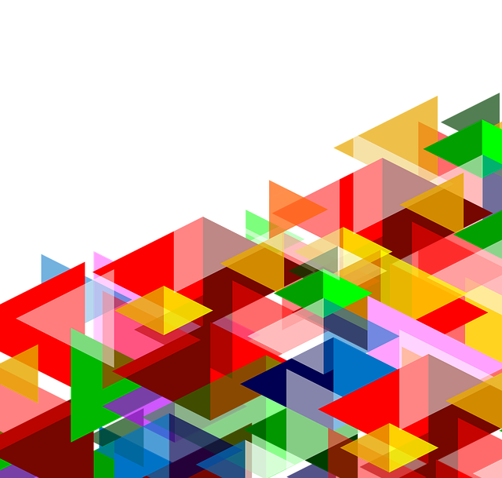

# Introduction to scientific working

## Graphics in LaTeX

Images in scientific documents have essential aspect to help clarify some aspets
of the work or give an overview over experiment constructions or other aspects.

LaTeX itself is a typesetting system and does not have capabilities to handle
images on its own.
To be able to handle images, the `graphicx` package has to be incorparated in a
LaTeX document:

```Latex
\documentclass{article}

\usepackage{graphicx}

\begin{document}

Some text that occurs before the text.

\includegraphics{graphics}
And text directly after.

\end{document}
```

Results in:

---

Some text that occurs before the text.


And text directly after.

---

In the above example you can see, that the extension is left out.
This forces the search for an image with all supported image-formats.
If a specific format is desired, the extension can be given.

We can seperate the images from the folder where the LaTeX files are.
To do this, we can specify `\graphicspath{}`, this instructs the
`\includegraphics` to search for fitting image files in the specified folder or
folders.

```Latex
\documentclass{article}

\usepackage{graphicx}
\graphicspath{ {./images} }
% or
\graphicspath{ {./images}{./logos}{./diagrams} }

\begin{document}

Some text that occurs before the text.

\includegraphics{graphics}
And text directly after.

\end{document}
```

The specification of `{./images}` tells the LaTeX compiler to look for a image
folder relative to the main LaTeX file.

- `{/home/koenen/images/}` ↣ Folder of images in user home folder.

  Independent where in the directory structure the LaTeX files are.

- `{c:/Users/koenen/images/}` ↣ Same as above but for Windows.

  Attention: it still uses forward slashes instead of backslashes.

### Parameters for graphics

The `\includegraphics` command has a place for optional parameters to change
some aspects of the included graphic.

```Latex
\graphicspath{ {./images} }

\includegraphics[scale=0.5]{graphics}
```

This uses the file `./images/graphics.*` and scales it down by 0.5, so dass it
is similar to:

---


---

An image can also be rotated:

```Latex
\graphicspath{ {./images} }

\includegraphics[scale=0.5, angle=45]{graphics}
```

---

<div style="height: 400px; padding-left: 80px">
  
</div>

---

### Images with captions and labels

The `\includegraphics` command does not provide a way to define the positioning
on the page or give it a label for referencing it.
Neither does it have the capabilities to attach a caption to it.

To do all these things an `\includegraphics` instruction must be wrapped in a
`figure` environment.

```Latex
\begin{figure}
  \includegraphics{graphics}
\end{figure}
```

## Next:

[LaTeX and Code](LaTeX-Code.md)
